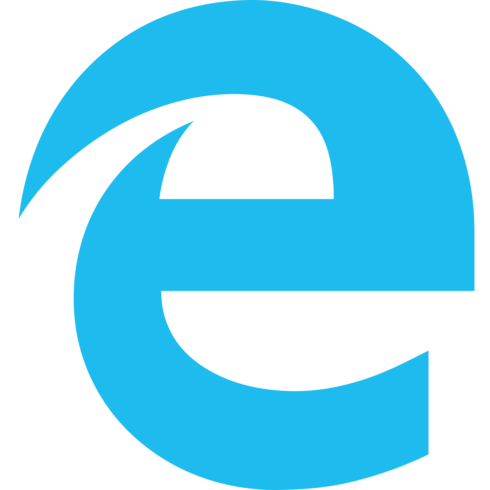
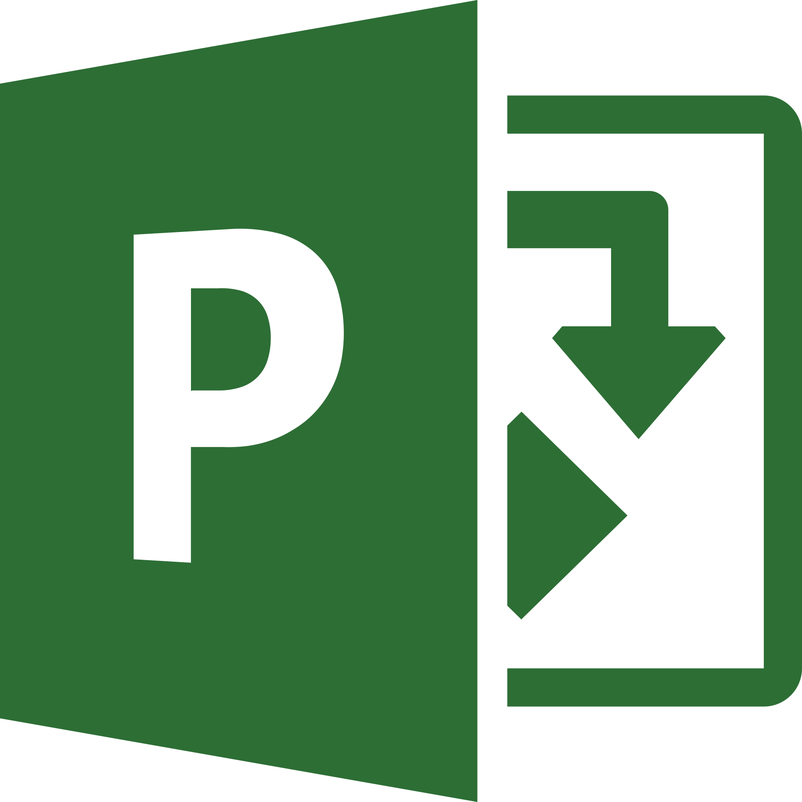
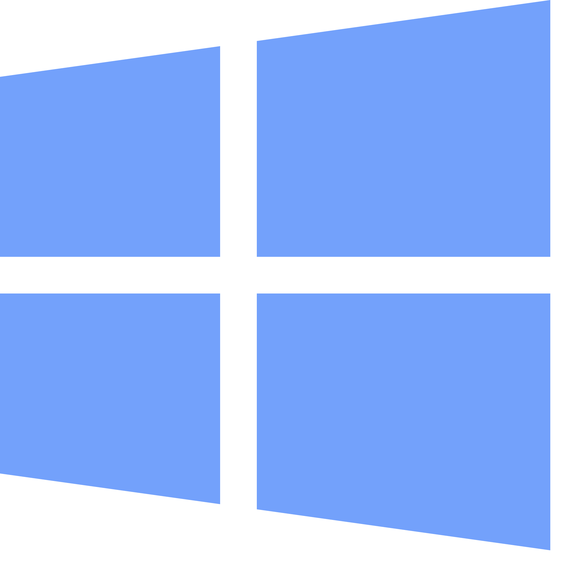

# WinApps for Linux
Run Windows apps such as Microsoft Office/Adobe in Linux (Ubuntu/Fedora) and GNOME/KDE as if they were a part of the native OS, including Nautilus integration for right clicking on files of specific mime types to open them.


***Proud to have made the top spot on [r/linux](https://www.reddit.com/r/linux) on launch day.***

## How it works
WinApps was created as an easy, one command way to include apps running inside a VM (or on any RDP server) directly into GNOME as if they were native applications. WinApps works by:
- Running a Windows RDP server in a background VM container
- Checking the RDP server for installed applications such as Microsoft Office
- If those programs are installed, it creates shortcuts leveraging FreeRDP for both the CLI and the GNOME tray
- Files in your home directory are accessible via the `\\tsclient\home` mount inside the VM
- You can right click on any files in your home directory to open with an application, too

## Currently supported applications
### WinApps supports ***ANY*** installed application on your system.

It does this by:
1. Scanning your system for offically configured applications (below)
2. Scanning your system for any other EXE files with install records in the Windows Registry

Any officially configured applications will have support for high-resolution icons and mime types for automatically detecting what files can be opened by each application. Any other detected executable files will leverage the icons pulled from the EXE.

Note: The officially configured application list below is fueled by the community, and therefore some apps may be untested by the WinApps team.

<table cellpadding="10" cellspacing="0" border="0">
  <tr>
    <td></td><td>Adobe Acrobat Pro<br>(X)</td>
    <td></td><td>Adobe Acrobat Reader<br>(DC)</td>
  </tr>
  <tr>
    <td></td><td>Adobe After Effects<br>(CC)</td>
    <td></td><td>Adobe Audition<br>(CC)</td>
  </tr>
  <tr>
    <td></td><td>Adobe Bridge<br>(CS6, CC)</td>
    <td></td><td>Adobe Creative Cloud<br>(CC)</td>
  </tr>
  <tr>
    <td></td><td>Adobe Illustrator<br>(CC)</td>
    <td></td><td>Adobe InDesign<br>(CC)</td>
  </tr>
  <tr>
    <td></td><td>Adobe Lightroom<br>(CC)</td>
    <td></td><td>Adobe Photoshop<br>(CS6, CC)</td>
  </tr>
  <tr>
    <td></td><td>Adobe Premiere Pro<br>(CC)</td>
    <td></td><td>Command Prompt<br>(cmd.exe)</td>
  </tr>
  <tr>
    <td></td><td>Explorer<br>(File Manager)</td>
    <td></td><td>Internet Explorer<br>(11)</td>
  </tr>
  <tr>
    <td></td><td>Microsoft Access<br>(2016, 2019, o365)</td>
    <td></td><td>Microsoft Excel<br>(2016, 2019, o365)</td>
  </tr>
  <tr>
    <td></td><td>Microsoft Word<br>(2016, 2019, o365)</td>
    <td></td><td>Microsoft OneNote<br>(2016, 2019, o365)</td>
  </tr>
  <tr>
    <td></td><td>Microsoft Outlook<br>(2016, 2019, o365)</td>
    <td></td><td>Microsoft PowerPoint<br>(2016, 2019, o365)</td>
  </tr>
  <tr>
    <td></td><td>Microsoft Project<br>(2016, 2019, o365)</td>
    <td></td><td>Microsoft Publisher<br>(2016, 2019, o365)</td>
  </tr>
  <tr>
    <td></td><td>Powershell<br>(Standard, Core)</td>
    <td></td><td>Visual Studio<br>(2019 - Ent|Pro|Com)</td>
  </tr>
  <tr>
    <td></td><td>Windows<br>(Full RDP session)</td>
    <td>&nbsp;</td><td>&nbsp;</td>
  </tr>
</table>

## Installation

### Step 1: Set up a Windows Virtual Machine
The best solution for running a VM as a subsystem for WinApps would be KVM. KVM is a CPU and memory-efficient virtualization engine bundled with most major Linux distributions. To set up the VM for WinApps, follow this guide:

- [Creating a Virtual Machine in KVM](docs/KVM.md)

If you already have a Virtual Machine or server you wish to use with WinApps, you will need to merge `kvm/RDPApps.reg` into the VM's Windows Registry. If this VM is in KVM and you want to use auto-IP detection, you will need to name the machine `RDPWindows`. Directions for both of these can be found in the guide linked above.

### Step 2: Download the repo and prerequisites
To get things going, use:
``` bash
sudo apt-get install -y freerdp2-x11
git clone https://github.com/Fmstrat/winapps.git
cd winapps
```
### Step 3: Creating your WinApps configuration file
You will need to create a `~/.config/winapps/winapps.conf` configuration file with the following information in it:
``` bash
RDP_USER="MyWindowsUser"
RDP_PASS="MyWindowsPassword"
#RDP_DOMAIN="MYDOMAIN"
#RDP_IP="192.168.123.111"
#RDP_SCALE=100
#RDP_FLAGS=""
#MULTIMON="true"
#DEBUG="true"
```
The username and password should be a full user account and password, such as the one created when setting up Windows or a domain user. It cannot be a user/PIN combination as those are not valid for RDP access.

Options:
- When using a pre-existing non-KVM RDP server, you can use the `RDP_IP` to specify it's location
- If you are running a VM in KVM with NAT enabled, leave `RDP_IP` commented out and WinApps will auto-detect the right local IP
- For domain users, you can uncomment and change `RDP_DOMAIN`
- On high-resolution (UHD) displays, you can set `RDP_SCALE` to the scale you would like [100|140|160|180]
- To add flags to the FreeRDP call, such as `/audio-mode:1` to pass in a mic, use the `RDP_FLAGS` configuration option
- For multi-monitor setups, you can try enabling `MULTIMON`, however if you get a black screen (FreeRDP bug) you will need to revert back
- If you enable `DEBUG`, a log will be created on each application start in `~/.local/share/winapps/winapps.log`

### Step 4: Run the WinApps installer
Lastly, check that FreeRDP can connect with:
```
bin/winapps check
```
You will see output from FreeRDP, as well as potentially have to accept the initial certificate. After that, a Windows Explorer window should pop up. You can close this window and press `Ctrl-C` to cancel out of FreeRDP.

If this step fails, try restarting the VM, or your problem could be related to:
- You need to accept the security cert the first time you connect (with 'check')
- Not enabling RDP in the Windows VM
- Not being able to connect to the IP of the VM
- Incorrect user credentials in `~/.config/winapps/winapps.conf`
- Not merging `install/RDPApps.reg` into the VM

Then the final step is to run the installer which will prompt you for a system or user install:
``` bash
./installer.sh
```
This will take you through the following process:


## Adding pre-defined applications
Adding applications with custom icons and mime types to the installer is easy. Simply copy one of the application configurations in the `apps` folder, and:
- Edit the variables for the application
- Replace the `icon.svg` with an SVG for the application (appropriately licensed)
- Re-run the installer
- Submit a Pull Request to add it to WinApps officially

When running the installer, it will check for if any configured apps are installed, and if they are it will create the appropriate shortcuts on the host OS.

## Running applications manually
WinApps offers a manual mode for running applications that are not configured. This is completed with the `manual` flag. Executables that are in the path do not require full path definition.
``` bash
./bin/winapps manual "C:\my\directory\executableNotInPath.exe"
./bin/winapps manual executableInPath.exe
```

## Checking for new application support
The installer can be run multiple times, so simply run the below again and it will remove any current installations and update for the latest applications.
``` bash
./installer.sh
```

## Optional installer command line arguments
The following optional commands can be used to manage your application configurations without prompts:
``` bash
./installer.sh --user                # Configure applications for the current user
./installer.sh --system              # Configure applications for the entire system
./installer.sh --user --uninstall    # Remove all configured applications for the current user
./installer.sh --system --uninstall  # Remove all configured applications for the entire system
```

## Installation on Arch Linux
Although WinApps is not officially supported on Arch Linux, it is still quite easy to get it working with a few minor tweaks. Installing winapps on Arch requires a few additional steps to configure the setup properly:

- **Installing KVM**: if you don't have KVM installed along with `virt-manager` (`virt-manager` will default to LXC connection if QEMU is not installed), follow these steps:

  - Install the required packages: `qemu virt-manager virt-viewer dnsmasq vde2 bridge-utils openbsd-netcat libguestfs ebtables iptables` using pacman.

  - Edit the file `/etc/libvirt/libvirtd.conf` as follows:

    - Change the `unix_sock_group` to `"libvirt"`

    - Set the `unix_sock_rw_perms` to `"0770"`

  - Add your user account to libvirt group using `usermod -a -G libvirt $(whoami)` (if the group doesn't exist, create it using `newgrp libvirt`).

  - After this, you can follow the instructions in the [KVM installation guide](docs/KVM.md) to install Windows VM.

- **Installing WinApps**: Before you follow the guide above to install winapps normally, make sure to set the following configurations:

  - Create a file `~/.config/libvirt/libvirt.conf` and add a single line in it: `uri_default = "qemu:///system"`. This allows you to run the VM and winapps without using `sudo`. (This assumes that the user has performed the previous steps as super user. In case performing this step stops `virt-manager` from accessing the VM, but removing the `libvirt.conf` file lets it work, then skip this step).

  - Run the command `virsh net-autostart default` to make sure that the 'default' connection is started after every reboot on Arch.


## Common issues
- **Black window**: This is a FreeRDP bug that sometimes comes up. Try restarting the application or rerunning the command. If that doesn't work, ensure you have `MULTIMON` disabled.

## Shout outs
- Some icons pulled from
  - Fluent UI React - Icons under [MIT License](https://github.com/Fmstrat/fluent-ui-react/blob/master/LICENSE.md)
  - Fluent UI - Icons under [MIT License](https://github.com/Fmstrat/fluentui/blob/master/LICENSE) with [restricted use](https://static2.sharepointonline.com/files/fabric/assets/microsoft_fabric_assets_license_agreement_nov_2019.pdf)
  - PKief's VSCode Material Icon Theme - Icons under [MIT License](https://github.com/Fmstrat/vscode-material-icon-theme/blob/master/LICENSE.md)
  - DiemenDesign's LibreICONS - Icons under [MIT License](https://github.com/Fmstrat/LibreICONS/blob/master/LICENSE)
