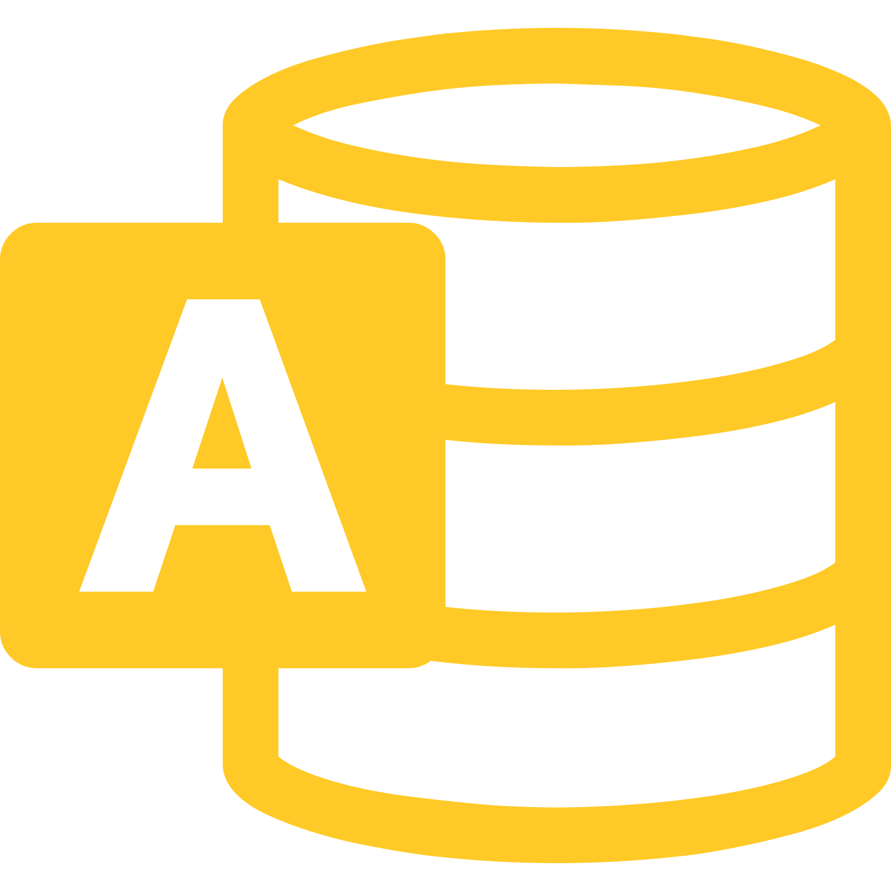

# WinApps for Linux
Run Windows apps such as Microsoft Office/Adobe in Linux (Ubuntu/Fedora) and GNOME/KDE as if they were a part of the native OS, including Nautilus integration for right clicking on files of specific mime types to open them.


***Proud to have made the top spot on [r/linux](https://www.reddit.com/r/linux) on launch day.***

## How it works
WinApps was created as an easy, one command way to include apps running inside a VM (or on any RDP server) directly into GNOME as if they were native applications. WinApps works by:
- Running a Windows RDP server in a background VM container
- Checking the RDP server for installed applications such as Microsoft Office
- If those programs are installed, it creates shortcuts leveraging FreeRDP for both the CLI and the GNOME tray
- Files in your home directory are accessible via the `\\tsclient\home` mount inside the VM
- You can right click on any files in your home directory to open with an application, too

## Currently supported applications
Note: The app list below is fueled by the community, and therefore many apps may be untested by the WinApps team.

<table cellpadding="10" cellspacing="0" border="0">
  <tr>
    <td></td><td>Adobe Acrobat Pro<br>(X)</td>
    <td></td><td>Adobe Acrobat Reader<br>(DC)</td>
  </tr>
  <tr>
    <td></td><td>Adobe After Effects<br>(CC)</td>
    <td></td><td>Adobe Audition<br>(CC)</td>
  </tr>
  <tr>
    <td></td><td>Adobe Bridge<br>(CS6, CC)</td>
    <td></td><td>Adobe Creative Cloud<br>(CC)</td>
  </tr>
  <tr>
    <td></td><td>Adobe Illustrator<br>(CC)</td>
    <td></td><td>Adobe InDesign<br>(CC)</td>
  </tr>
  <tr>
    <td></td><td>Adobe Lightroom<br>(CC)</td>
    <td></td><td>Adobe Photoshop<br>(CS6, CC)</td>
  </tr>
  <tr>
    <td></td><td>Adobe Premiere Pro<br>(CC)</td>
    <td></td><td>Command Prompt<br>(cmd.exe)</td>
  </tr>
  <tr>
    <td></td><td>Explorer<br>(File Manager)</td>
    <td></td><td>Internet Explorer<br>(11)</td>
  </tr>
  <tr>
    <td></td><td>Microsoft Access<br>(2016, 2019, o365)</td>
    <td></td><td>Microsoft Excel<br>(2016, 2019, o365)</td>
  </tr>
  <tr>
    <td></td><td>Microsoft Word<br>(2016, 2019, o365)</td>
    <td></td><td>Microsoft OneNote<br>(2016, 2019, o365)</td>
  </tr>
  <tr>
    <td></td><td>Microsoft Outlook<br>(2016, 2019, o365)</td>
    <td></td><td>Microsoft PowerPoint<br>(2016, 2019, o365)</td>
  </tr>
  <tr>
    <td></td><td>Microsoft Project<br>(2016, 2019, o365)</td>
    <td></td><td>Microsoft Publisher<br>(2016, 2019, o365)</td>
  </tr>
  <tr>
    <td></td><td>Powershell</td>
    <td></td><td>Visual Studio<br>(2019 - Ent|Pro|Com)</td>
  </tr>
  <tr>
    <td></td><td>Windows<br>(Full RDP session)</td>
    <td>&nbsp;</td><td>&nbsp;</td>
  </tr>
</table>

## Installation

### Step 1: Download the repo and prerequisites
You will need to store the WinApps repo in a permanent place and not remove it after install. To get things going, use:
``` bash
sudo apt-get install -y freerdp2-x11
git clone https://github.com/Fmstrat/winapps.git
cd winapps
```
### Step 2: Creating your WinApps configuration file
You will need to create a `~/.config/winapps/winapps.conf` configuration file with the following information in it:
``` bash
RDP_USER="MyWindowsUser"
RDP_PASS="MyWindowsPassword"
#RDP_DOMAIN="MYDOMAIN"
#RDP_IP="192.168.123.111"
#RDP_SCALE=100
#RDP_FLAGS=""
#MULTIMON="true"
#DEBUG="true"
#VIRT_MACHINE_NAME="machine-name"
#VIRT_NEEDS_SUDO="true"
#USE_SECRET_TOOL="true"
```

#### Using Secret Tool for RDP_PASS

You can add the RDP password for lookup using secret tool. Label can be whatever you want it to be.

```bash
secret-tool store --label='winapps' service winapps
```

Options:
- When using a pre-existing non-KVM RDP server, you can use the `RDP_IP` to specify it's location
- If you are running a VM in KVM with NAT enabled, leave `RDP_IP` commented out and WinApps will auto-detect the right local IP
- For domain users, you can uncomment and change `RDP_DOMAIN`
- On high-resolution (UHD) displays, you can set `RDP_SCALE` to the scale you would like [100|140|160|180]
- To add flags to the FreeRDP call, such as `/audio-mode:1` to pass in a mic, use the `RDP_FLAGS` configuration option
- For multi-monitor setups, you can try enabling `MULTIMON`, however if you get a black screen (FreeRDP bug) you will need to revert back
- If you enable `DEBUG`, a log will be created on each application start in `~/.local/share/winapps/winapps.log`

### Step 3: Setting up your Windows VM

#### Option 1 - Running KVM
You can refer to the [KVM](https://www.linux-kvm.org) documentation for specifics, but the first thing you need to do is set up a Virtual Machine running Windows 10 Professional (or any version that supports RDP). First, clone WinApps and install KVM and FreeRDP:
``` bash
sudo apt-get install -y virt-manager
```

Now set up KVM to run as your user instead of root and allow it through AppArmor (for Ubuntu 20.04 and above):
``` bash
sudo sed -i "s/#user = "root"/user = "$(id -un)"/g" /etc/libvirt/qemu.conf
sudo sed -i "s/#group = "root"/group = "$(id -gn)"/g" /etc/libvirt/qemu.conf
sudo usermod -a -G kvm $(id -un)
sudo usermod -a -G libvirt $(id -un)
sudo systemctl restart libvirtd
sudo ln -s /etc/apparmor.d/usr.sbin.libvirtd /etc/apparmor.d/disable/

sleep 5

sudo virsh net-autostart default
sudo virsh net-start default
```
**You will likely need to reboot to ensure your current shell is added to the group.**

Next, define a VM called RDPWindows from the sample XML file with:
``` bash
virsh define kvm/RDPWindows.xml
virsh autostart RDPWindows
```

To increase performance of the VM and decrease resource utilization, read the [Improving Performance](#improving-performance) section.

You will now want to change any settings on the VM and install Windows and whatever programs you would like, such as Microsoft Office. If the definition fails, you can always manually create a VM. You can access VMs with:
``` bash
virt-manager
```

#### Option 2 - I already have an RDP server or VM
If you already have an RDP server or VM, using WinApps is very straight forward. Simply skip to step 4!

### Step 4: Configuring your Windows VM
After the install process, or on your current RDP server, you will want to:
- Go to the Start Menu
    - Type "About"
    - Open "About"
    - Change the PC name to "RDPWindows" if you are using KVM (This will allow WinApps to detect the local IP)
- Go to Settings
    - Under "System", then "Remote Desktop" allow remote connections for RDP
- Merge `kvm/RDPApps.reg` into the registry to enable RDP Applications

### Step 5: Connect GNOME/KDE to your Windows VM with shortcuts and file associations
Lastly, check that FreeRDP can connect with:
```
bin/winapps check
```
You will see output from FreeRDP, as well as potentially have to accept the initial certificate. After that, a Windows Explorer window should pop up. You can close this window and press `Ctrl-C` to cancel out of FreeRDP.

If this step fails, try restarting the VM.

Then the final step is to run the installer:
``` bash
$ ./installer.sh --user
Removing any old configurations... 
Installing...
  Checking for installed apps in RDP machine (this may take a while)... Finished.
  Configuring Excel... Finished.
  Configuring PowerPoint... Finished.
  Configuring Word... Finished.
  Configuring Windows... Finished.
Installation complete.
```

## Adding applications
Adding applications to the installer is easy. Simply copy one of the application configurations in the `apps` folder, and:
- Edit the variables for the application
- Replace the `icon.svg` with an SVG for the application (appropriately licensed)
- Re-run the installer
- Submit a Pull Request to add it to WinApps officially

When running the installer, it will check for if any configured apps are installed, and if they are it will create the appropriate shortcuts on the host OS.

## Running applications manually
WinApps offers a manual mode for running applications that are not configured. This is completed with the `manual` flag. Executables that are in the path do not require full path definition.
``` bash
./bin/winapps manual "C:\my\directory\executableNotInPath.exe"
./bin/winapps manual executableInPath.exe
```

## Checking for new application support
The installer can be run multiple times, so simply run:
``` bash
$ git pull
$ ./installer.sh --user
Removing any old configurations... 
  Removing /home/fmstrat/.local/share/applications/excel.desktop... Finished.
  Removing /home/fmstrat/.local/share/applications/powerpoint.desktop... Finished.
  Removing /home/fmstrat/.local/share/applications/windows.desktop... Finished.
  Removing /home/fmstrat/.local/share/applications/word.desktop... Finished.
  Removing /home/fmstrat/.local/bin/excel... Finished.
  Removing /home/fmstrat/.local/bin/powerpoint... Finished.
  Removing /home/fmstrat/.local/bin/windows... Finished.
  Removing /home/fmstrat/.local/bin/word... Finished.
Installing...
  Checking for installed apps in RDP machine (this may take a while)... Finished.
  Configuring Excel... Finished.
  Configuring PowerPoint... Finished.
  Configuring Word... Finished.
  Configuring Windows... Finished.
Installation complete.
```

## Installer usage
The following commands can be used to manage your application configurations:
``` bash
./installer.sh --user                # Configure applications for the current user
./installer.sh --system              # Configure applications for the entire system
./installer.sh --user --uninstall    # Remove all configured applications for the current user
./installer.sh --system --uninstall  # Remove all configured applications for the entire system
```

## Improving performance

#### Reducing idle CPU usage from ~25% to ~3%
In KVM, the CPU timing is not optimized by default. Use `virsh edit RDPWindows` to edit the VM and change:
``` xml
<clock offset='localtime'>
  <timer name='rtc' tickpolicy='catchup'/>
  <timer name='pit' tickpolicy='delay'/>
  <timer name='hpet' present='no'/>
  <timer name='hypervclock' present='yes'/>
</clock>
```
to:
``` xml
<clock offset='localtime'>
  <timer name='hpet' present='yes'/>
  <timer name='hypervclock' present='yes'/>
</clock>
```

## Shout outs
- Some icons pulled from
  - Fluent UI React - Icons under [MIT License](https://github.com/Fmstrat/fluent-ui-react/blob/master/LICENSE.md) 
  - Fluent UI - Icons under [MIT License](https://github.com/Fmstrat/fluentui/blob/master/LICENSE) with [restricted use](https://static2.sharepointonline.com/files/fabric/assets/microsoft_fabric_assets_license_agreement_nov_2019.pdf)
  - PKief's VSCode Material Icon Theme - Icons under [MIT License](https://github.com/Fmstrat/vscode-material-icon-theme/blob/master/LICENSE.md)
  - DiemenDesign's LibreICONS - Icons under [MIT License](https://github.com/Fmstrat/LibreICONS/blob/master/LICENSE)
  
